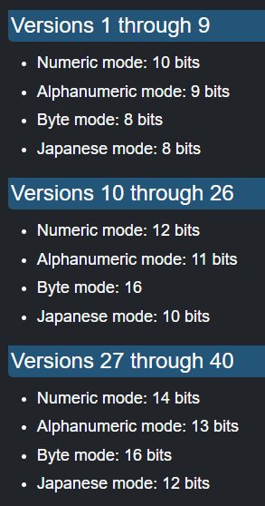
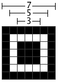

# QR CODE GENERATOR

## SPEC FOR NOW
VERSION 10 (57x57)
ERROR CORRECTION Low
DATA ENCODING UTF-8

## Version 10
I'll try version 10 for now. 
- Standard ECC200 ISO/IEC 15434  (i think) 
- 57 x 57 px
- Up to 174 characters (395 ALPHA WITH LOW DATA CORRECTION)

## Error Correction Level
- L : 7% recovery capacity.
- M : 15% recovery capacity. (default)
- Q : 25% recovery capacity.
- H : 30% recovery capacity.

## DATA
### Data Encoding
[GREAT HELP HERE](https://www.thonky.com/qr-code-tutorial/data-encoding)

There is 4 encoding modes you can chose from:
- (0001) Numeric [0..9]
- (0010) Alphanumeric [A..Z, 0..9, {'$', '%', '*', '+', '-', '.', '/', ' '}]
- (0100) Byte [0..255] (8-bit) (default) - (Generaly characters form ISO-8859-1)
- (1000) Kanji [0..1023] extended Kanji characters - Cmon don't use this.
> I'll probably only use Byte mode encoded in UTF-8 for now since i'll mainly use this for Links. I think that most Readers support UTF-8.
[ENCODING IN BYTES](https://www.thonky.com/qr-code-tutorial/byte-mode-encoding)

The 4 bits code is the encoding mode indicator.

### Data Length
The lenght of the message encoded must be specified. It has to respect a certain size depending on the version

>e.g.
for version 10, the message "HEY GRAHAM" encoded in byte mode is 10 bytes long.
The number 10 has to be encoded in 16 bits (padded with 0s if necessary)
So : 0b0000'0000'0000'1010 = 10

### Data settings bits
Now that we know how to select an encoding mode and the get the lenght of the message, we can build the bit whole bit "string".

We just need to concatenate the 4 bits encoding code and the length of the message: 
> 0100 || 0b0000'0000'0000'1010 = 0b0100'0000'0000'0000'1010

### Final Data
We now have to concatenate everything: The encoding mode, the lenght of the message and the message itself.

Example with HEY GRAHAM (10 char of 8 (pad with zeroes if only 7) bits = 80 bytes)
|---| Encoding Mode | Length | Message | Terminator |
|---| ------------ | ------ | ------- | --- |
Size (bits)| 4        |  16    | 80     | 4         |
Value | 4        | 10      | 72 101 108 108 111 32 87 111 114 108 100 | 0
Value | 0b0100        | 0b0000'0000'0000'1010      |01001000 01100101 01101100 01101100 01101111 00100000 01010111 01101111 01110010 01101100 01100100 | 0000

The thing is, The QR code needs to have all its bits full, this means we need to pad the data until we reach the maximum size

#### Maximum size
The max size depends on the version, correction level [source](https://www.thonky.com/qr-code-tutorial/error-correction-table), since i've chosen version 10 and low correction so the maximum data size is: 274 bytes.

|Version and EC Level |Total Number of Data Codewords for this Version and EC Level|EC Codewords Per Block|Number of Blocks in Group 1|Number of Data Codewords in Each of Group 1's Blocks|Number of Blocks in Group 2| Number of Data Codewords in Each of Group 2's Blocks|Total Data Codewords|
|--|--|--|--|--|--|--|--|
|10-L | 274|	18|	2|	68|	2|	69|	(68 * 2) + (69 * 2) = 274|

EC Codewords Per Block = Error correction bytes per block

The data has to be brokenb down into groups depending on the version. These groups can again be broken down into blocks. Each group may contain multiple blocks, and each block may contain a given amount of data codewords. 
For example, the data for version 10, level L has 274 data codewords, and each group contains 2 blocks, each block of group 1 contains 68 data codewords, and each block of group 2 contains 69 data codewords. Thus the maximum number of codewords is 68 * 2 + 69 * 2 = 274. This includes the data + error correction codewords. Each block has a total of 18 error correction codewords. So the total number of codewords we can use for the actual data is  274 - (18 * 2) = 252.

## Placing everything

### Finder patterns
3 finder patterns to help the scanner find the QR code.

### Timing patterns
Timing patterns need to start with a dark and end with a dark

### Format information
The format information is needed. 

## MODULES USED
[Polynomial Manipulation](polynomial.md)
[PNG Rendering](png.md)

## SOURCES
https://en.wikipedia.org/wiki/QR_code
LIVRE : https://1lib.ch/book/21301139/f37eda
NORME : https://1lib.ch/book/6042350/45e9cc
INSANE HELP : https://www.thonky.com/qr-code-tutorial/module-placement-matrix#:~:text=The%20finder%20patterns%20are%20always,which%20version%20is%20in%20use.
ALIGNEMENT TABLE : https://www.thonky.com/qr-code-tutorial/alignment-pattern-locations
https://dev.to/maxart2501/let-s-develop-a-qr-code-generator-part-viii-different-sizes-1e0e

--- 

