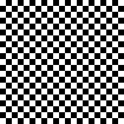

# QR CODE GENERATOR

## Version
I'll try version 10 for now. 
- Standard ECC200 ISO/IEC 15434  (i think) 
- 57 x 57 px
- Up to 174 characters (395 ALPHA WITH LOW DATA CORRECTION)

## Error Correction Level
- L : 7% recovery capacity.
- M : 15% recovery capacity. (default)
- Q : 25% recovery capacity.
- H : 30% recovery capacity.

## Placing everything

### Finder patterns
3 finder patterns to help the scanner find the QR code.


## SOURCES
https://en.wikipedia.org/wiki/QR_code
LIVRE : https://1lib.ch/book/21301139/f37eda
NORME : https://1lib.ch/book/6042350/45e9cc
INSANE HELP : https://www.thonky.com/qr-code-tutorial/module-placement-matrix#:~:text=The%20finder%20patterns%20are%20always,which%20version%20is%20in%20use.
ALIGNEMENT TABLE : https://www.thonky.com/qr-code-tutorial/alignment-pattern-locations
https://dev.to/maxart2501/let-s-develop-a-qr-code-generator-part-viii-different-sizes-1e0e


## Polynomial manpulation

### Create Polynomial
> Second parameter is a modulo
```go
b := create_poly([]int64{1, 1, 3, -4, 2}, 5)
```

### Show Polynomial
```go
b.show()
```
OUTPUTS 
```go
2x^4 + -4x^3 + 3x^2 + 1x^1 + 1
```

### Add Polynomial
```go
add_ab := a.add(b)
```

### Multiply Polynomial
```go
mul_ab := a.mul(b)
```

### Evaluate Polynomial
```go
x := int64(7)
ax := a.eval(x)
```

--- 

## PNG Rendering API
### Create Pixels object
```go
pix := create_pixel_array(w, h)
```

### Set a pixel
```go
pix.set_pixel(x, y, true)
```

### Get a pixel
```go
pix.get_pixel(x, y)
```

### Encode pixels into PNG
```go
img := pix.to_img()
```

### SAVE Pixels object to PNG
```go
pix.save_to_png(10, "image.png")
```

### Output


---

## Multiplicative Inverse
### Extended Euclidean Algorithm
> x, y are Bézout coefficients
```go
gcd, x, y := extended_euclidean(a, b)
```

### Find Multiplicative Inverse
> Find a^-1 mod b
```go
x := mult_inverse(a, b)
```

## REED SOLOMON

### MESSAGE ENCODING (Reed-Solomon)

