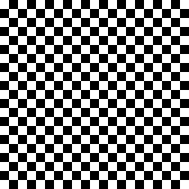

# QR CODE GENERATOR

## POLYNOMIAL MANIPULARION
### CREATE POLYNOMIAL
> Second parameter is a modulo
```go
b := create_poly([]int64{1, 1, 3, -4, 2}, 5)
```

### SHOW POLYNOMIAL
```go
b.show()
```
OUTPUTS 
```go
2x^4 + -4x^3 + 3x^2 + 1x^1 + 1
```

### ADD POLYNOMIALS
```go
add_ab := a.add(b)
```

### MUL POLYNOMIALS
```go
mul_ab := a.mul(b)
```

### EVAL POLYNOMIAL
```go
x := int64(7)
ax := a.eval(x)
```

--- 

## PNG RENDERING API
### CREATE PIXELS OBJECT
```go
pix := create_pixel_array(w, h)
```

### SET A PIXEL
```go
pix.set_pixel(x, y, true)
```

### GET A PIXEL
```go
pix.get_pixel(x, y)
```

### ENCODE PIXELS INTO PNG
```go
img := pix.to_img()
```

### SAVE PIXELS OBJECT INTO A PNG FILE
```go
pix.save_to_png(10, "image.png")
```

### OUTPUT
